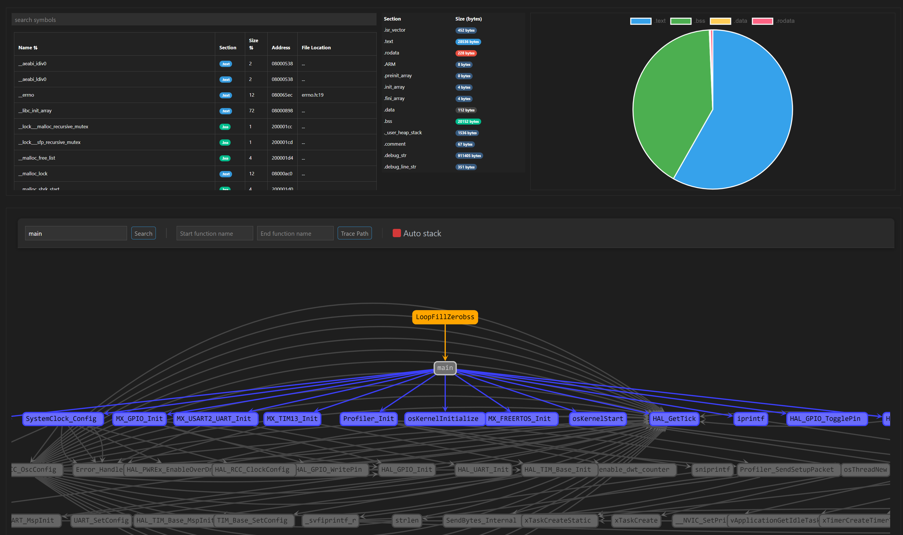

# ELFInsight: A Powerful ELF Symbol and Call Graph Visualizer for VS Code

Welcome to **ELFInsight**, your go-to Visual Studio Code extension for analyzing ELF files with ease! ELFInsight offers a streamlined, user-friendly interface to view symbol tables, inspect memory usage, and visualize function call graphs.

### ✨ Features:
1. **ELF Symbol Table Viewer**:
   - Effortlessly view all symbols in your ELF files, categorized by name, section, type, size, and memory address.
   - **Dynamic Sorting**: Quickly sort symbols by name or size with just a click.
   - **Search Functionality**: Instantly find symbols with the built-in search feature, which highlights matches for easy identification. 🔍

2. **Memory Usage Breakdown**:
   - Get a clear picture of memory distribution across key sections like `.text`, `.bss`, `.data`, and `.rodata`.
   - **Interactive Bar Chart**: Visualize the memory usage of each section, ensuring you stay aware of your project’s memory footprint. 📊

3. **Call Graph Visualization**:
   - Understand your program's structure with a detailed **call graph**.
   - Nodes represent functions, while edges show relationships between them, allowing you to trace execution paths. 🧭
   - **Interactive Navigation**: Click on nodes to highlight incoming and outgoing edges, making it easy to follow the flow of function calls.

4. **Path Tracing**: 
   - Enter a start and end function to trace the path between them, visually mapping how the functions interact in your codebase. 🛤️

5. **Flexible Search in Call Graphs**:
   - Quickly locate functions in the call graph by searching for function names.
   - Matched nodes are highlighted, and the view zooms in for easy inspection. 🎯

### 🚀 How to Use:
1. **Open an ELF File**: 
   - Select an ELF file from the explorer side panel and it will open with ELF Insight as long as no other
   extension is set to open `.elf` files. The symbol table and memory usage will be displayed.

2. **Reccomendation**:
    - To improve call graph results, compile your code with optimization level `-Og` **(Optimize for Debugging)** to capture as many function calls as possible.
    - ElfInsight will if the elf file being read was not made with the same version of ARM GNU binaries pointed to in the settings, there will be a missmatch of debug information structure.

---

This extension is perfect for firmware developers, embedded engineers, or anyone needing deeper insight into their ELF binaries. Happy coding with **ELFInsight**! 🎉

Developed with ❤️ by **Eddie**. 

File issues/bugs/requests on GitHub: [ELFInsight Repository](https://github.com/EdwinFairchild/ELFInsight-VSCode) 🖥️